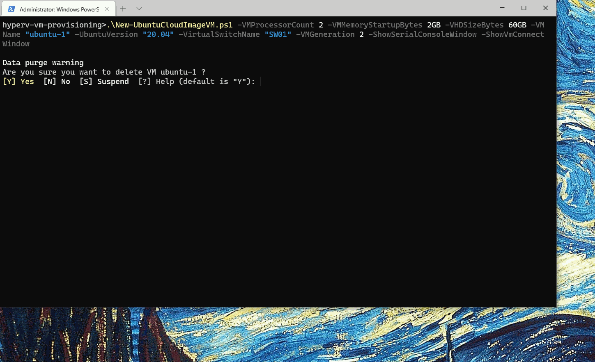

# Powershell scripts for Ubuntu 22.04 VM provisioning on Hyper-V

## Source

https://github.com/schtritoff/hyperv-vm-provisioning

## Description

Placer les fichiers dans un répertoire sur le serveur Hyper-V, puis exécuter le script.

## Remote Usage (Exécution à distance)

- Start Connexion (Entrez les infos de connexion au serveur Hyper-V)
```powershell
./start-session.ps1
```

- Go to the directory
```powershell
cd .\hyperv-vm-provisioning\
```
#### Create VM 

- Via la ligne de commande que l'on peut modifier 
```powershell
.\New-HyperVCloudImageVM.ps1 -VMProcessorCount 2 -VMMemoryStartupBytes 2GB -VHDSizeBytes 60GB -VMName "ubuntu-100" -ImageVersion "22.04" -VMGeneration 2 -VirtualSwitchName "NIC - VM" -VMMachine_StoragePath "H:\hyperv" -GuestAdminUsername "user" -GuestAdminPassword "password"
```

- Via le fichier qui contient la ligne de commande (Modifier les paramètres, comme login ou password, disque, ram, etc dans le fichier create-vm.ps1)
```powershell
.\create-vm.ps1
```
---
Le processus de création de la VM prends ensuite environ 5 minutes (à cause du cloudinit qui travail, ensuite la vm va reboot et c'est finit).

- Ensuite on peut récupérer l'adresse IP de la VM avec la commande suivante:
```powershell
.\get-ip.ps1 -Name VMname
```

## Usage Local (Exécution sur le serveur directement)

- Create VM
```powershell
.\local_create-vm.ps1
```

## Delete VM

- Delete VM and Files
```powershell
.\Cleanup-VM.ps1 VMname
```


---

## Demo



